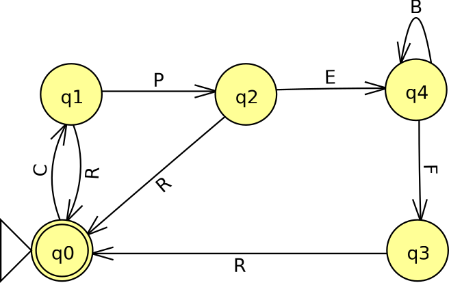
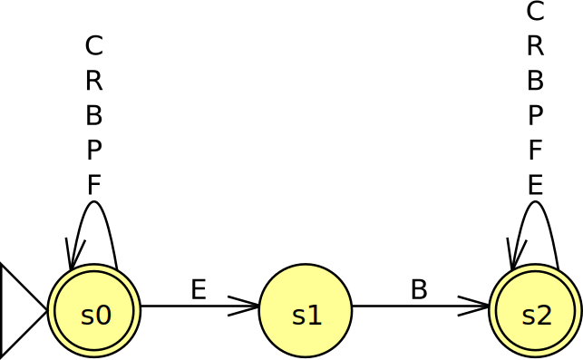
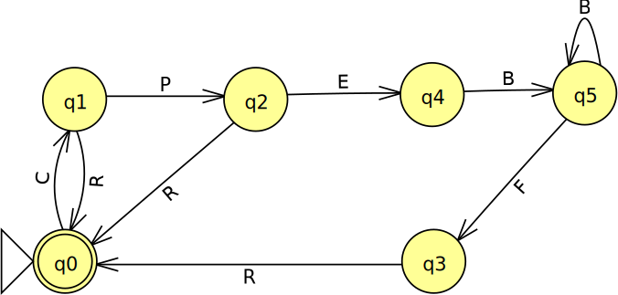
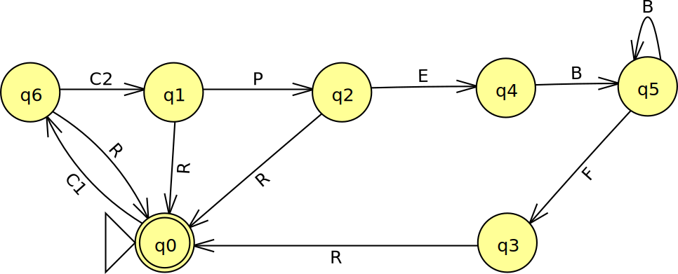

# Model Checking

This project implements a DFA simulator to do model checking.

## Required Virtual Machine

To run this project, you need [node.js](http://nodejs.org/) installed; a
lightweight javascript vm based on Google's V8 engine.

## 1. Introduction 

- What is model checking? 
    - It is the automatic analysis of correctness of an abstract model of
      a computer program model (DFA).
    - __Input__: finite state description of a system to be analyzed and a
      specification the model needs to satisfy.
    - __Output__: if the model satisfies the specification then you are
      notified, otherwise a counter example is supplied.

- Where is it used?
    - NASA uses models checking in the application development to check
      the correctness of their software.

## 2. Finite Automata 

- What is the formal definition of an automaton? 

A finite automaton, formally, is a five-tuple $(Q,\Sigma, \delta, q\_0, F)$ where:

- $Q$ is the set of states in the DFA
- $\Sigma$ is the input alphabet (symbols recognized by the DFA).
- $\delta$ is the transition function.
- $q\_0$ is the initial state.
- $F$ is the set of final/accept thats.

These five components describe entirely how the automation is suppose to work.

- What data structure did you use to represent the automaton? 

In my implementation, I used a object of the following form to describe
the NFA/DFA (very similar to formal definition):

	{
		"Q": [...]      /* array of states */
		"Sigma": [...]  /* array of input symbols */
		"delta": {},    /* transition function/table */
		"initial": "",  /* initial state of DFA*/
		"accept": []    /* array of accept states */
	}

## 3. Operations on Automata 

- What is the algorithm that you used to compute the complement and
  intersection?
    - __Intersection__: computed using cross-product construction, as
      described in class.
    - __Complement__: computed by modifying the accepts states:
        - $F' = Q - F$
- What is the computational complexity of the algorithms? 
    - The intersection uses the cross-product construction. Thus we need
      to take into account the combinations of the states of each machine
      and calculate the transitions. Therefore the time complexity is:
      $O(|Q\_1|*|Q\_2|)$.
    - The complement can be computed in $O(|Q|)$ as it is just the
      difference in the states.

## 4. Searching for counterexamples 

- How do you search an automaton for a string? 
    - Essentially, a DFA can be though of as a graph and to find a counter
      example, I used the DFS (depth-first-search) graph search algorithm.
- What is the computational complexity of the search algorithm? 
    - As learned in any introductory algorithms course, the DFS search
      algorithm is $O(m + n)$. Where $m$ is the number of edges and $n$ is
      the number of states. This results in $O(|Q|*|\Sigma| + |Q|)$ for a
      formally defined DFA.

## 5. Infusion pump example

### Part 1 - Model Verification

Firstly, I saw how an infusion pump could be represented as a DFA.

And how to create a specification automaton to validate the model of the
infusion pump.

After running the program on the [specification and infusion pump
model](./inputs/infusion-pump.txt), I found an error in the model by way
of a counter example "$CPEFR$".

I then fixed the model infusion pump as follows:

which can be found in
[inputs/infusion-pump-fixed.txt](./inputs/infusion-pump-fixed.txt). The
application validated that this new model satisfies the specification.

### Part 2 - Extending the model

To add a constant\_rate\_2 we can use the following model:

As a specification we can use the following regular expression:

$S\_2 = ( C\_1 \cup C\_2 ) \Sigma ^{\*} R$ 

## 6. Conclusions 

After completing this project, I have learned the value in abstracting any
real-world system into a formal/mathematical model. By doing so, we gain
many useful tools that help analyze the correctness of the model. These
techniques would not be able to be applied to any arbitrary piece of
software as these methods apply directly to software that represents a
DFA. 

This relates to something we learned in class. As you use more powerful
computational models, you lose provable properties. By restricting
ourselves to a simpler model, we gain many useful properties, such as
validating models.
